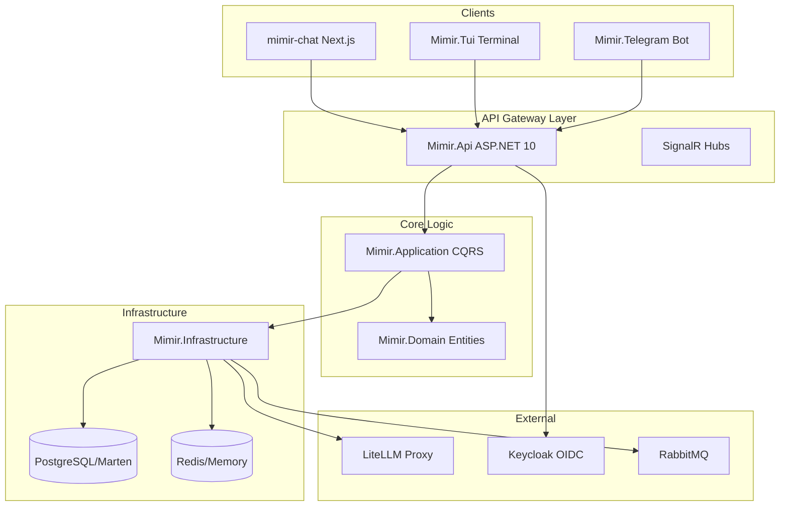

# nem.Mimir

[](LICENSE)
[](https://dotnet.microsoft.com/download/dotnet/10.0)
[](https://www.docker.com/)

> nem.Mimir is an enterprise-grade AI orchestration platform built on .NET 10. It provides a unified API for multi-LLM workflows, real-time streaming, sandboxed code execution, and robust identity management.

Mimir enables organizations to build, deploy, and scale AI-powered assistants with a focus on security, observability, and extensibility. By leveraging LiteLLM for model abstraction and Keycloak for identity, Mimir provides a production-ready foundation for modern AI applications.

## Table of Contents

- [Core Features](#core-features)
- [Architecture Overview](#architecture-overview)
- [Project Structure](#project-structure)
- [Getting Started](#getting-started)
  - [Prerequisites](#prerequisites)
  - [Quick Start (Docker)](#quick-start-docker)
  - [Local Development](#local-development)
- [Configuration](#configuration)
- [API Capabilities](#api-capabilities)
- [Security Model](#security-model)
- [Plugin System](#plugin-system)
- [Testing & Quality](#testing--quality)
- [Documentation Index](#documentation-index)
- [Contributing](#contributing)
- [License](#license)

## Core Features

- **Multi-LLM Orchestration**: Unified interface for OpenAI, Anthropic, Gemini, Llama, and local models via LiteLLM proxy.
- **Real-time Streaming**: Sub-second latency response streaming using Server-Sent Events (SSE) and SignalR Hubs.
- **Sandboxed Execution**: Securely execute Python and JavaScript code generated by LLMs in isolated Docker containers.
- **Enterprise Security**: OpenID Connect (OIDC) integration with Keycloak, fine-grained RBAC, and OPA-ready authorization policies.
- **Asynchronous Processing**: Durable messaging and event sourcing using Wolverine and RabbitMQ for long-running AI tasks.
- **Multi-Channel Support**: Native support for Web (React/Next.js), Terminal (TUI), and Telegram Bot interfaces.
- **Observability**: Structured logging with Serilog, OpenTelemetry support, and comprehensive audit logging.

## Architecture Overview

Mimir follows a Clean Architecture approach with a modular monolith design, transitioning towards a distributed event-driven system.



For a deeper dive, see [docs/ARCHITECTURE.md](docs/ARCHITECTURE.md).

## Project Structure

The solution consists of 9 projects organized by responsibility:

- **src/Mimir.Api**: Entry point. Minimal APIs, SignalR Hubs, and Middleware (Rate limiting, Exception handling).
- **src/Mimir.Application**: Core business logic. MediatR handlers, FluentValidation, and Service interfaces.
- **src/Mimir.Domain**: Pure domain layer. Entities, Value Objects, Domain Events, and Enums.
- **src/Mimir.Infrastructure**: External concerns. EF Core/Marten persistence, LLM clients, and Sandbox services.
- **src/Mimir.Sync**: Background worker. Wolverine handlers for asynchronous events and audit logging.
- **src/Mimir.Tui**: Rich terminal interface for low-latency developer chat.
- **src/Mimir.Telegram**: High-concurrency Telegram bot integration.
- **src/mimir-chat**: Modern Next.js web application for end-users.
- **tests/**: Comprehensive test suite (>1,000 tests) including Unit, Integration, and E2E.

## Getting Started

### Prerequisites

- **.NET 10 SDK** or later.
- **Docker Desktop** (with Compose v2).
- **Node.js 20+** (if running the web frontend locally).
- **LiteLLM Instance** (or an OpenAI-compatible API key).

### Quick Start (Docker)

The fastest way to get Mimir running with all its dependencies is using Docker Compose:

```bash
# Clone the repository
git clone https://github.com/nem/mimir.git
cd nem.Mimir

# Setup environment
cp .env.example .env

# Launch all services
docker compose up -d
```

Once started, the following endpoints are available:
- **API**: `http://localhost:5000` (Swagger at `/swagger`)
- **Web UI**: `http://localhost:3000`
- **Keycloak**: `http://localhost:8080` (admin/admin)
- **RabbitMQ**: `http://localhost:15672` (guest/guest)

### Local Development

To run the API and TUI locally for development:

```bash
# 1. Start infra only
docker compose up -d db keycloak rabbitmq litellm

# 2. Configure secrets (one-time)
dotnet user-secrets set "ConnectionStrings:DefaultConnection" "Host=localhost;Database=mimir;Username=postgres;Password=postgres" --project src/Mimir.Api

# 3. Run the API
dotnet run --project src/Mimir.Api

# 4. Open TUI in another terminal
dotnet run --project src/Mimir.Tui
```

## Configuration

Mimir uses standard .NET configuration providers. Environment variables are preferred for containerized deployments.

| Variable | Description | Default |
|----------|-------------|---------|
| `Database__ConnectionString` | PostgreSQL connection string | - |
| `RabbitMQ__ConnectionString` | RabbitMQ connection string | - |
| `LiteLlm__BaseUrl` | URL of the LiteLLM proxy | `http://localhost:4000` |
| `LiteLlm__ApiKey` | API Key for LiteLLM | - |
| `Jwt__Authority` | Keycloak realm URL | - |
| `Jwt__Audience` | OIDC Client ID | `mimir-api` |
| `Telegram__BotToken` | Token from BotFather | - |

Detailed configuration options can be found in [docs/DEPLOYMENT.md](docs/DEPLOYMENT.md).

## API Capabilities

Mimir provides a robust REST API and an OpenAI-compatible gateway:

- **Conversations**: Full CRUD for chat threads with metadata support.
- **Messages**: Send prompts and receive streamed or block-buffered assistant responses.
- **System Prompts**: Template-driven system instructions with variable injection.
- **Models**: Dynamic model discovery and capability metadata.
- **OpenAI Gateway**: Drop-in replacement for OpenAI SDKs at `/v1/chat/completions`.
- **Code Execution**: Direct endpoints for sandboxed computation within chat context.

See the full [API-REFERENCE.md](docs/API-REFERENCE.md) for request/response schemas.

## Security Model

Mimir implements a "Zero Trust" approach for AI orchestration:

1. **Authentication**: Every request must carry a valid JWT from Keycloak.
2. **Authorization**: Fine-grained permissions managed via OPA (Open Policy Agent) logic.
3. **Prompt Safety**: Input sanitization prevents prompt injection and leakage.
4. **Rate Limiting**: Per-user sliding window limits prevent resource exhaustion.
5. **Data Isolation**: Multi-tenant data structures ensure users only see their own history.
6. **Execution Safety**: Code execution occurs in disposable Docker containers with restricted network and resource limits.

More details in [docs/SECURITY.md](docs/SECURITY.md).

## Plugin System

The system is extensible via a dynamic plugin architecture. Plugins can be loaded at runtime to add new capabilities:

- **WebSearch**: Real-time information retrieval from the live web.
- **CodeRunner**: High-performance execution of multi-language scripts.
- **Mimir.Infrastructure.Plugins**: Base library for building custom integrations.

## Testing & Quality

We maintain a high quality bar through automated testing:

- **Unit Tests**: Domain logic and handler verification (xUnit).
- **Integration Tests**: API and Infrastructure verification using **Testcontainers**.
- **Negative Testing**: Over 130 tests dedicated to failure modes and security edge cases.
- **Standardization**: Strict adherence to RFC 7807 (ProblemDetails) for error reporting.

```bash
# Run all tests
dotnet test
```

## Documentation Index

- [Architecture Guide](docs/ARCHITECTURE.md)
- [API Reference](docs/API-REFERENCE.md)
- [Deployment & Operations](docs/DEPLOYMENT.md)
- [Security Architecture](docs/SECURITY.md)
- [Changelog & Refactoring History](docs/CHANGELOG.md)

## Contributing

Mimir is an open-source project. We welcome contributions in the form of bug reports, feature requests, and pull requests.

Please read our [Contributing Guide](CONTRIBUTING.md) before submitting.

## License

nem.Mimir is licensed under the MIT License. See [LICENSE](LICENSE) for the full text.
