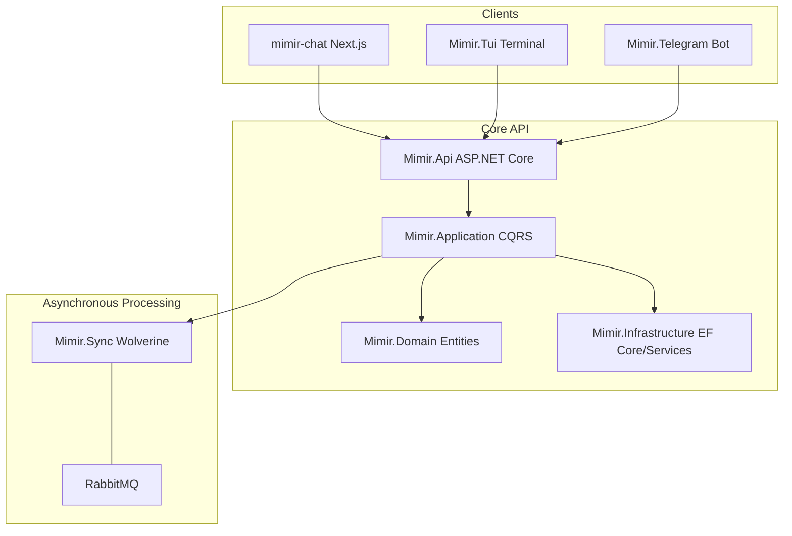

# nem.Mimir

> Enterprise AI chat platform built on .NET 10, featuring multi-LLM orchestration via LiteLLM, real-time streaming via SignalR, plugin-based extensibility, and Keycloak-powered identity management.

## Table of Contents
- [Architecture Overview](#architecture-overview)
- [Prerequisites](#prerequisites)
- [Quick Start](#quick-start)
- [Project Structure](#project-structure)
- [Configuration](#configuration)
- [Services](#services)
- [Testing](#testing)
- [Security](#security)
- [Plugins](#plugins)
- [Documentation](#documentation)
- [License](#license)

## Architecture Overview
nem.Mimir is a distributed enterprise AI platform utilizing a modular monolith approach with asynchronous processing. The system orchestrates multiple Large Language Models (LLMs) through a LiteLLM proxy, providing real-time response streaming via SignalR and robust identity management through Keycloak. Detailed architectural decisions and patterns are documented in [ADR-004-architecture-overview.md](docs/adr/ADR-004-architecture-overview.md).

## Prerequisites
- .NET SDK 10.0+
- Docker & Docker Compose v2
- PostgreSQL 16+ (or use Docker)
- Keycloak 24+ (or use Docker)
- RabbitMQ 3.x (or use Docker)
- Node.js 20+ (only for mimir-chat frontend)

## Quick Start

### Using Docker Compose (recommended)
1. Copy the example environment file: `cp .env.example .env`
2. Start the services: `docker compose up -d`
3. Access the components:
    - API: `http://localhost:5000`
    - Keycloak: `http://localhost:8080`
    - RabbitMQ Management: `http://localhost:15672`
    - mimir-chat at: `http://localhost:3000`

### Local Development
1. Restore dependencies: `dotnet restore`
2. Configure user-secrets for `ConnectionStrings`, `Jwt`, `RabbitMQ`, and `LiteLlm`.
3. Run the API: `dotnet run --project src/Mimir.Api`
4. For TUI: `dotnet run --project src/Mimir.Tui`
5. For Telegram: `dotnet run --project src/Mimir.Telegram`

## Project Structure


- **src/Mimir.Api**: ASP.NET Core Web API + SignalR hub
- **src/Mimir.Application**: CQRS handlers, MediatR, FluentValidation, Mapperly
- **src/Mimir.Domain**: entities, value objects, enums
- **src/Mimir.Infrastructure**: EF Core, repositories, services
- **src/Mimir.Sync**: Wolverine message handlers
- **src/Mimir.Tui**: Terminal UI client
- **src/Mimir.Telegram**: Telegram bot
- **src/mimir-chat**: Next.js frontend
- **tests/**: 9 test projects with 1,022 tests
- **docs/**: ADRs, security, data model, deployment
- **docker/**: Dockerfiles for various services
- **keycloak/**: Realm export for identity management

## Configuration
| Variable | Description |
|----------|-------------|
| `ConnectionStrings__DefaultConnection` | PostgreSQL connection string |
| `Jwt__Authority` | OIDC provider URL (Keycloak) |
| `Jwt__Audience` | Registered audience for JWT validation |
| `Jwt__RequireHttpsMetadata` | Whether to require HTTPS for OIDC metadata |
| `RabbitMQ__Host` | RabbitMQ server hostname |
| `RabbitMQ__Port` | RabbitMQ server port |
| `RabbitMQ__User` | RabbitMQ username |
| `RabbitMQ__Password` | RabbitMQ password |
| `LiteLlm__BaseUrl` | Base URL for LiteLLM proxy |
| `Telegram__BotToken` | Token for the Telegram bot |
| `Cors__AllowedOrigins` | Array of permitted CORS origins |

## Services
| Service | Default Port | Description |
|---------|--------------|-------------|
| Mimir.Api | 5000 | Core REST API and SignalR hubs |
| mimir-chat | 3000 | Next.js web interface |
| Keycloak | 8080 | Identity and Access Management |
| LiteLLM | 4000 | LLM Orchestration Proxy |
| PostgreSQL | 5432 | Primary relational database |
| RabbitMQ | 5672 / 15672 | Message broker and management UI |
| Sandbox | Isolated | Isolated Docker execution environment |

## Testing
- `dotnet test` executes 1,022 tests across 9 projects.
- **Test Distribution**:
    - Domain: 220 tests
    - Application: 185 tests
    - Infrastructure: 247 tests
    - Api.Tests: 64 tests
    - Api.IntegrationTests: 93 tests
    - Telegram: 55 tests
    - Tui: 39 tests
    - Sync: 16 tests
    - E2E: 13 tests
- **Frameworks**: xUnit v3, Shouldly, NSubstitute
- **Integration**: Testcontainers (PostgreSQL, RabbitMQ), WireMock.Net
- **Coverage**: Run `dotnet test --collect:"XPlat Code Coverage"` for metrics.

## Security
nem.Mimir implements a multi-layered security model detailed in [docs/security-architecture.md](docs/security-architecture.md).
- **Authentication**: OIDC via Keycloak with JWT Bearer validation.
- **Authorization**: Role-based access control (Admin, User).
- **Network**: Secure headers (HSTS, CSP), CORS policy, and rate limiting.
- **Data**: Input sanitization and output encoding middleware.
- **Isolation**: Plugin execution occurs within restricted Docker sandboxes.

## Plugins
- **CodeRunner**: Docker-based isolated code execution for Python and C#.
- **WebSearch**: Integration for real-time web search capabilities.
- **Architecture**: Design details available in [ADR-002-plugin-architecture.md](docs/adr/ADR-002-plugin-architecture.md).

## Documentation
- [Architecture Overview](docs/adr/ADR-004-architecture-overview.md)
- [Data Model](docs/data-model.md)
- [Security Architecture](docs/security-architecture.md)
- [Deployment Runbook](docs/deployment-runbook.md)
- [Security Threat Model](docs/security-threat-model.md)
- [ADR-001: OpenChat UI Pivot](docs/adr/ADR-001-openchat-ui-pivot.md)
- [ADR-002: Plugin Architecture](docs/adr/ADR-002-plugin-architecture.md)
- [ADR-003: Wolverine Messaging](docs/adr/ADR-003-wolverine-messaging.md)

## License
See LICENSE file for details.

AI-powered chat platform with multi-channel support (Web, TUI, Telegram).

## Architecture

```
┌─────────────────┐     ┌──────────────┐     ┌─────────────────┐
│  mimir-chat     │────▶│   Mimir.Api  │────▶│   Mimir.Sync    │
│  (Next.js UI)   │     │   (ASP.NET)  │     │  (Wolverine)    │
└─────────────────┘     └──────────────┘     └─────────────────┘
                              │                        │
                              ▼                        ▼
                       ┌──────────────┐         ┌──────────────┐
                       │   Keycloak  │         │    RabbitMQ  │
                       │   (Auth)    │         │   (Messages) │
                       └──────────────┘         └──────────────┘
                              │
                              ▼
                       ┌──────────────┐
                       │  PostgreSQL  │
                       │   (Data)     │
                       └──────────────┘
```

## Services

| Service | Description | Port |
|---------|-------------|------|
| `Mimir.Api` | REST API + SignalR hub | 5000 |
| `Mimir.Sync` | Wolverine message processor | - |
| `Mimir.Tui` | Terminal UI client | - |
| `Mimir.Telegram` | Telegram bot | - |
| `mimir-chat` | Next.js web UI | 3000 |
| `Keycloak` | Authentication | 8080 |
| `RabbitMQ` | Message broker | 5672 |
| `sandbox` | Code execution plugin | - |

## Quick Start

### Prerequisites
- .NET 8 SDK
- Node.js 20+
- Docker & Docker Compose
- PostgreSQL (optional, via Docker)

### Development

```bash
# Clone and setup
git clone https://github.com/yourorg/nem.Mimir.git
cd nem.Mimir

# Start infrastructure
docker-compose up -d db keycloak rabbitmq

# Run API
cd src/Mimir.Api
dotnet run

# Run chat UI (separate terminal)
cd src/mimir-chat
npm install
npm run dev
```

### Production (Docker)

```bash
docker-compose up -d
```

## Configuration

Environment variables:
- `DATABASE_URL` - PostgreSQL connection
- `KEYCLOAK_URL` - Keycloak server
- `RABBITMQ_URL` - RabbitMQ connection
- `LITELLM_URL` - LLM proxy endpoint

## Plugins

Built-in plugins:
- **CodeRunner** - Execute code in isolated sandbox
- **WebSearch** - Web search capability (stub)

## Security

- Authentication via Keycloak (OAuth2/OIDC)
- CSP + HSTS headers in production
- Correlation IDs for request tracing
- Plugin isolation via AssemblyLoadContext

## Testing

```bash
# Unit tests
dotnet test --filter "FullyQualifiedName~Mimir.Application.Tests"

# E2E tests (requires Docker)
dotnet test --filter "FullyQualifiedName~Mimir.E2E.Tests"
```

## License

MIT
