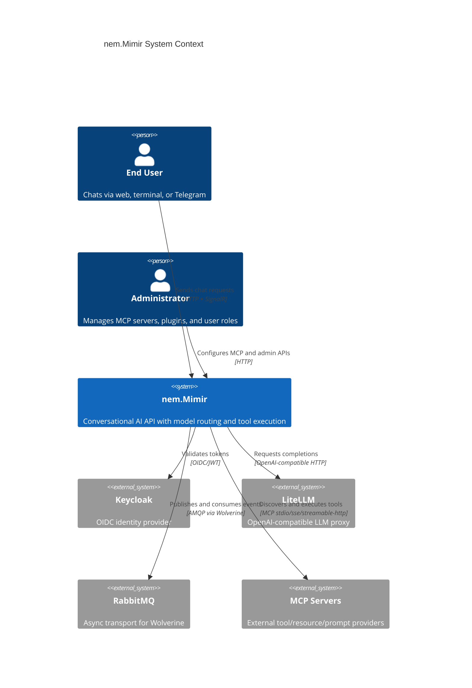
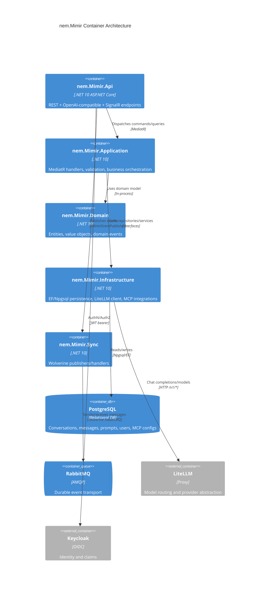

<!-- sync-hash: ab01558ac0bdd682ae745ad871c7b726 -->
---
repo: nem.Mimir
tier: tier-1
status: regenerated
---

# Architekturdokumentation: nem.Mimir

## Zusammenfassung
`nem.Mimir` ist ein Legacy-Dienst für Konversations-KI mit hybrider Architektur:
- **MediatR CQRS** für in-prozessuale Command-/Query-Verarbeitung.
- **Wolverine + RabbitMQ** für asynchrone Event-Publikation und Hintergrundverarbeitung.
- **LiteLLM-Proxy-Integration** für anbieterneutrale LLM-Inferenz.
- **MCP-Server-Integration** für externe Tool-/Ressourcen-/Prompt-Aufrufe.

Die aktive Modernisierungslinie ist `nem.Mimir-typed-ids`; dieses Repository bleibt der kanonische Legacy-Laufzeit- und Dokumentationsumfang.

## C4 System Context (Level 1)

## C4 Container View (Level 2)

## Schichten und Verantwortlichkeiten
- `nem.Mimir.Api`: Controller, OpenAI-Kompatibilität, SignalR `ChatHub`, Middleware, Auth-Setup.
- `nem.Mimir.Application`: Commands/Queries für Konversationen, Prompts, Plugins, MCP-Admin, OpenAI-Kompatibilität.
- `nem.Mimir.Domain`: `Conversation`, `Message`, `SystemPrompt`, `User`, MCP-Konfigurationsentitäten, Tool-Abstraktionen.
- `nem.Mimir.Infrastructure`: DB-Kontext/-Konfigurationen, Repositories, LiteLLM-Adapter, MCP-Client-Manager, Sanitization.
- `nem.Mimir.Sync`: Wolverine-Konfiguration, Publisher-Abstraktion, Audit-/Event-Handler.

## Laufzeit-Request-Flows
### REST/OpenAI-Kompatibilität
`OpenAiCompatController` bedient `/v1/chat/completions` und `/v1/models` mit optionalem SSE-Streaming.

### Native Konversationsflüsse
`MessagesController` -> `SendMessageCommand` -> Kontextaufbau -> optionaler Tool-Loop -> Persistenz der Assistant-Antwort.

### Echtzeitfluss
`ChatHub.SendMessage` verwendet kanalbasiertes Token-Streaming und persistiert teilweise bzw. vollständige Assistant-Nachrichten.

## Messaging-Architektur
- Der API-Host aktiviert Wolverine in `Program.cs` über `AddMimirMessaging`.
- RabbitMQ-Durable-Inbox/Outbox-Policies sind global aktiv.
- Der Event-Publisher (`MimirEventPublisher`) sendet Chat- und Audit-Lifecycle-Messages.
- `AuditEventHandler` persistiert Audit-Messages über den Application-Audit-Service.

## Architekturhinweise zu KI und Tooling
- Tool-Calls sind jetzt First-Class in `SendMessageCommand` und den LiteLLM-DTOs.
- Der MCP-Client-Stack umfasst Auto-Connect beim Start und Reconciliation bei Konfigurationsänderungen.
- Tool-Namen werden im `McpToolProvider` per Server-Präfix kollisionsfrei gemacht.
- Whitelist- und Audit-Decorator erzwingen Governance rund um Tool-Aufrufe.

## Persistenzarchitektur
Der Primärspeicher ist PostgreSQL über `MimirDbContext`.
Wichtige Datensätze:
- conversations/messages
- users
- system prompts
- MCP server config/whitelists/audit logs

Soft-Delete und Audit-Zeitstempel werden durch `AuditableEntityInterceptor` für `BaseAuditableEntity<Guid>` behandelt.

## Abhängigkeits-Hinweise
- Gemeinsame Security-/Secrets-Integration über `nem.Contracts.AspNetCore`.
- Die Application referenziert `nem.KnowHub.Agents` und `nem.KnowHub.Abstractions` für Reasoner-Agent-Integration.
- MCP-SDK-Abhängigkeit: `ModelContextProtocol`.

## Trennung zwischen Legacy und aktivem Strang
Dieses Repository wird als Legacy-Quelle für Laufzeitdokumentation gepflegt.
Der Typed-ID-Implementierungsstrang (`nem.Mimir-typed-ids`) ist die aktive Entwicklungslinie und als Nachfolgearchitektur zu behandeln, nicht als separater Dienst.

## Querverweise
- [AI](./AI.md)
- [BUSINESS-LOGIC](./BUSINESS-LOGIC.md)
- [INFRASTRUCTURE](./INFRASTRUCTURE.md)
- [SECURITY](./SECURITY.md)
