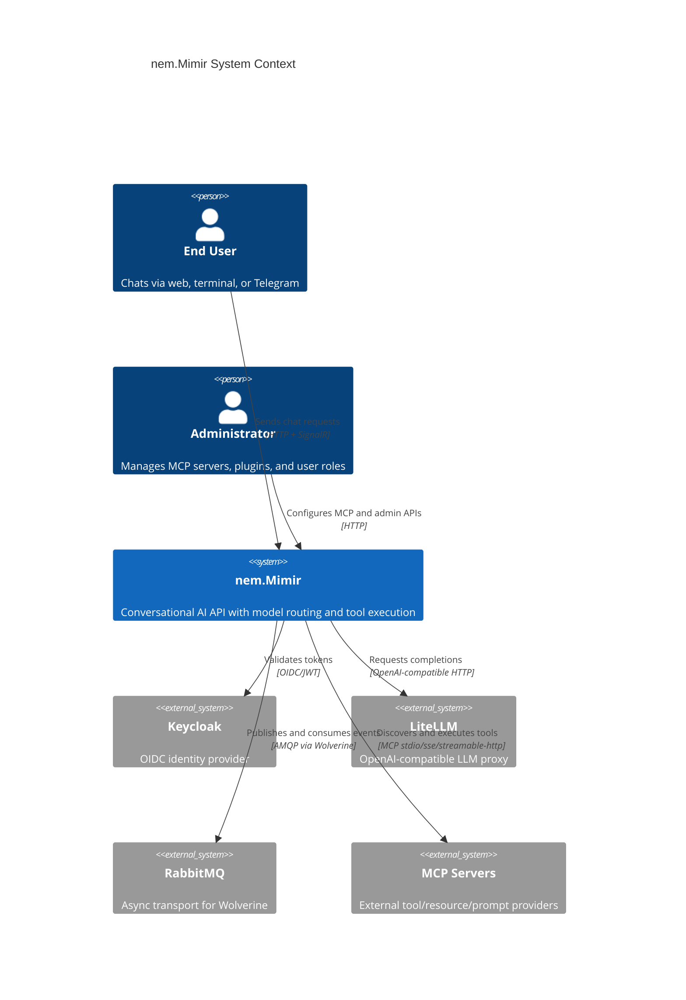
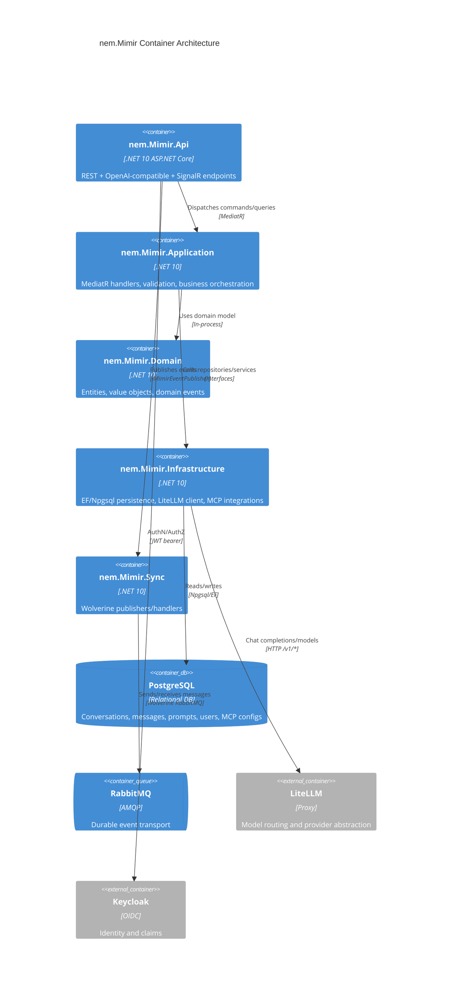

# Architecture Documentation: nem.Mimir

## Executive summary
`nem.Mimir` is a legacy conversational AI service implementing a hybrid architecture:
- **MediatR CQRS** for in-process command/query handling.
- **Wolverine + RabbitMQ** for asynchronous event publication and background processing.
- **LiteLLM proxy integration** for provider-agnostic LLM inference.
- **MCP server integration** for external tool/resource/prompt invocation.

The active modernization line is `nem.Mimir-typed-ids`; this repository remains canonical legacy runtime and documentation scope.

## C4 System Context (Level 1)

## C4 Container View (Level 2)

## Layer boundaries and responsibilities
- `nem.Mimir.Api`: controllers, OpenAI compatibility, SignalR `ChatHub`, middleware, auth setup.
- `nem.Mimir.Application`: commands/queries for conversations, prompts, plugins, MCP admin, OpenAI compatibility.
- `nem.Mimir.Domain`: `Conversation`, `Message`, `SystemPrompt`, `User`, MCP config entities, tool abstractions.
- `nem.Mimir.Infrastructure`: DB context/configurations, repositories, LiteLLM adapter, MCP client manager, sanitization.
- `nem.Mimir.Sync`: Wolverine configuration, publisher abstraction, audit/event handlers.

## Runtime request flows
### REST/OpenAI compatibility
`OpenAiCompatController` handles `/v1/chat/completions` and `/v1/models` with optional SSE streaming.

### Native conversation flow
`MessagesController` -> `SendMessageCommand` -> context assembly -> optional tool loop -> assistant persistence.

### Real-time flow
`ChatHub.SendMessage` uses channel-backed token streaming and persists partial/full assistant messages.

## Messaging architecture
- API host enables Wolverine in `Program.cs` using `AddMimirMessaging`.
- RabbitMQ durable inbox/outbox policies are enabled globally.
- Event publisher (`MimirEventPublisher`) emits chat and audit lifecycle messages.
- `AuditEventHandler` persists audit messages via application audit service.

## AI/tooling architecture notes
- Tool calls are now first-class in `SendMessageCommand` and LiteLLM DTOs.
- MCP client stack includes startup auto-connect and config-change reconciliation.
- Tool names are collision-resolved by server prefixing in `McpToolProvider`.
- Whitelist and audit decorators enforce governance around tool invocation.

## Persistence architecture
Primary store is PostgreSQL via `MimirDbContext`.
Key datasets:
- conversations/messages
- users
- system prompts
- MCP server config/whitelists/audit logs

Soft delete and audit timestamps are handled by `AuditableEntityInterceptor` for `BaseAuditableEntity<Guid>`.

## Dependency highlights
- Shared security/secrets integration via `nem.Contracts.AspNetCore`.
- Application references `nem.KnowHub.Agents` and `nem.KnowHub.Abstractions` for reasoner-agent integration.
- MCP SDK dependency: `ModelContextProtocol`.

## Legacy/active split
This repository is maintained as legacy runtime documentation source.
The typed-ID implementation track (`nem.Mimir-typed-ids`) is the active development line and should be treated as successor architecture, not a separate service.

## Cross-references
- [AI](./AI.md)
- [BUSINESS-LOGIC](./BUSINESS-LOGIC.md)
- [INFRASTRUCTURE](./INFRASTRUCTURE.md)
- [SECURITY](./SECURITY.md)
