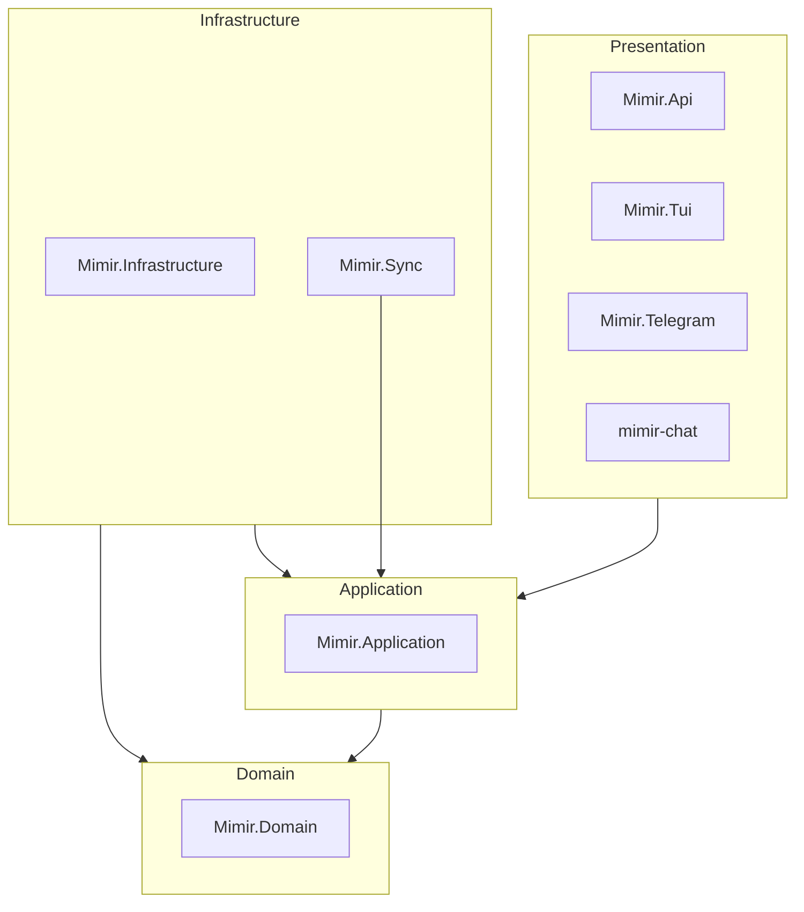
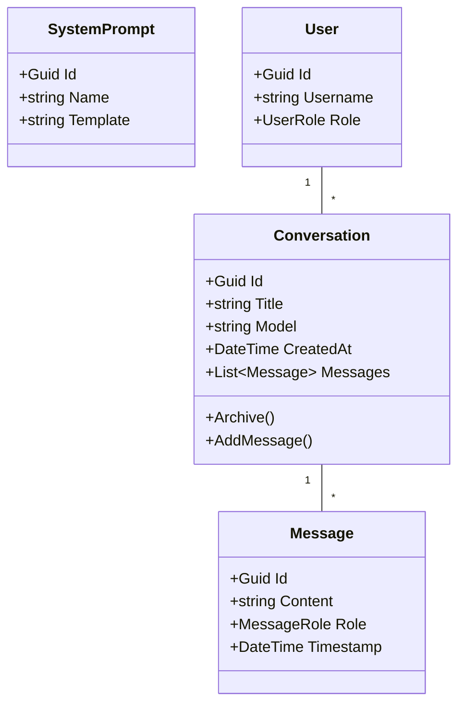
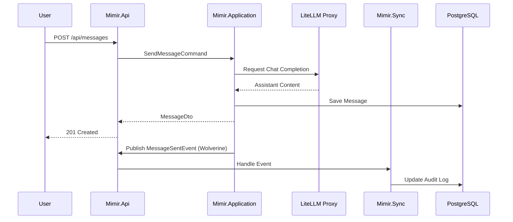

# Architecture Guide: nem.Mimir

nem.Mimir is designed as a modular monolith with clear separation of concerns, following Clean Architecture principles. It leverages an event-driven approach for asynchronous operations and audit logging.

## Solution Overview

The system is composed of several layers, each with a specific responsibility.

### Layer Responsibilities

1.  **Domain**: Contains pure business logic, entities, value objects, and domain events. It has zero dependencies on other projects or external frameworks.
2.  **Application**: Implements the CQRS pattern using MediatR. It contains command and query handlers, service interfaces, and DTOs. It depends only on the Domain layer.
3.  **Infrastructure**: Implements the interfaces defined in the Application layer. This includes persistence (EF Core, Marten), AI provider integrations (LiteLLM), and external services (Sandbox, Search).
4.  **API**: The main entry point. It hosts the Minimal APIs, SignalR Hubs, and handles cross-cutting concerns like authentication, rate limiting, and global exception handling.
5.  **Sync**: A background worker that consumes events from the message broker (RabbitMQ) using Wolverine. It handles side effects like audit logging and cross-service synchronization.

## Layered Architecture Details

### Domain Model

The domain model is built around the `Conversation` aggregate.

### Request Flow (Sync vs Async)

Mimir distinguishes between low-latency user interactions and background processing.

## Messaging & Events

Mimir uses **Wolverine** with **RabbitMQ** for durable messaging.

- **Inbox/Outbox Pattern**: Ensures that domain changes and message publishing are atomic. If the database save fails, the message isn't sent. If the message sending fails, it will be retried.
- **Audit Logging**: Every significant action (message sent, conversation created, plugin executed) triggers an event that Mimir.Sync captures and persists to the audit table.

## AI Orchestration

The system does not talk directly to LLM providers (OpenAI, Anthropic, etc.). Instead, it uses **LiteLLM** as a proxy.

- **Unified Interface**: `ILlmService` provides a consistent way to interact with any model.
- **Streaming**: Supports Server-Sent Events (SSE) for real-time token delivery.
- **Reliability**: LiteLLM handles retries, fallback models, and rate-limit management.

## Persistence Strategy

- **Relational (EF Core)**: Used for structured data like Users, System Prompts, and Audit Logs.
- **Document/Event Store (Marten)**: Used for Conversation history and complex state transitions where event sourcing or flexible schemas are beneficial.
- **Soft Deletion**: All major entities support soft deletion via `ISoftDelete` and a global query filter.

## Security Architecture

- **Identity**: Keycloak handles OIDC and provides JWTs.
- **Policy Enforcement**: API endpoints use `[Authorize]` attributes combined with custom policies.
- **Sandbox**: Code execution is physically isolated in Docker containers, controlled by the `SandboxService`.

## Performance & Scalability

- **Caching**: `IMemoryCache` is used for frequently accessed data like model lists and system prompts.
- **Rate Limiting**: `Microsoft.AspNetCore.RateLimiting` protects the API from abuse.
- **Horizontal Scaling**: Since the API is stateless (auth is JWT-based, session state is in DB/Queue), multiple instances can run behind a load balancer.
