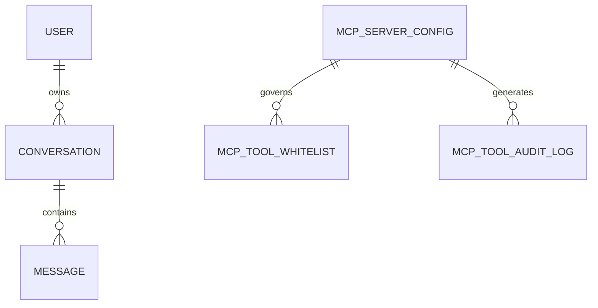

<!-- sync-hash: ab16197e841102767902b434ba135d32 -->
---
repo: nem.Mimir
tier: tier-1
status: regenerated
---

# Datenmodell-Dokumentation: nem.Mimir

## Überblick
Die Persistenz basiert auf `MimirDbContext` (PostgreSQL/Npgsql). Das Modell kombiniert Konversationsentitäten, Identitätsentitäten, Prompt-Templates und operative MCP-Entitäten.

## Primäre Entitäten
- `User`
- `Conversation`
- `Message`
- `SystemPrompt`
- `AuditEntry`
- `McpServerConfig`
- `McpToolWhitelist`
- `McpToolAuditLog`

## Entitäts-Beziehungsmodell

## Conversation-Aggregat
- Tabelle: `conversations`
- Wichtige Felder:
  - `id` (Guid, app-generiert)
  - `user_id`
  - `title`
  - `status` (enum-as-string)
  - Audit-Felder (`created_at`, `updated_at`, `created_by`, `updated_by`)
  - Soft-Delete-Felder (`is_deleted`, `deleted_at`)

Das zugeordnete Value Object `ConversationSettings` wird auf folgende Spalten gemappt:
- `settings_max_tokens`
- `settings_temperature`
- `settings_model`
- `settings_auto_archive_days`
- `settings_system_prompt_id`

## Message-Entität
- Tabelle: `messages`
- Wichtige Felder:
  - `id`
  - `conversation_id`
  - `role`
  - `content` (`text`-Spalte)
  - `model`
  - `token_count`
  - `created_at`

Nachrichten sind aus Geschäftssicht append-only; auf `Message` gibt es keine Soft-Delete-Felder.

## User-Entität
- Tabelle: `users`
- Wichtige Felder:
  - `username`, `email`, `role`
  - `is_active`
  - Login-Zeitstempel
  - auditierbare + Soft-Delete-Spalten

Eindeutiger Index auf `email`.

## System-Prompt-Entität
- Tabelle: `system_prompts`
- Wichtige Felder:
  - `name`, `template`, `description`
  - `is_default`, `is_active`
  - auditierbare + Soft-Delete-Spalten

Indizes:
- `ix_system_prompts_is_default`
- `ix_system_prompts_is_active`

## Audit-Entität
- Tabelle: `audit_entries`
- Erfasst Benutzeraktion, Entitätstyp/-id, Zeitstempel, Details und IP.
- Indexiert über `(user_id, timestamp)`.

## Operative MCP-Entitäten
### McpServerConfig
Speichert Transportmodus und Verbindungsmetadaten (`stdio`/`sse`/`streamable-http`) samt enabled/disabled-Status.

### McpToolWhitelist
Pro-Server-Allowlist-Datensätze, die vor der Ausführung zur Whitelist-Erzwingung dienen.

### McpToolAuditLog
Persistiert Tool-Ausführungstelemetrie: Toolname, Input/Output, Latenz, Erfolg/Fehler.

## Persistenzstrategie und Konventionen
- EF Core mit expliziten Tabellen-/Spaltennamen.
- `ValueGeneratedNever()` für app-generierte GUID-Identifier.
- Optimistische Konkurrenzkontrolle nutzt PostgreSQL `xmin` auf auditierbaren Entitäten.
- `HasQueryFilter` erzwingt Sichtbarkeitsregeln für Soft-Delete auf auditierbaren Entitäten.

## Datenlebenszyklus
1. Erstellung von Konversationen/Nachrichten aus API-Commands.
2. Update-Flows (Titel/Einstellungen/Prompt-Metadaten).
3. Soft-Delete für auditierbare Entitäten (Interceptor und explizite Repository-Logik).
4. Optionaler Admin-Restore-Pfad für unterstützte Entitätstypen.

## Query-Muster
- Benutzerbezogene Konversations-Paginierung sortiert nach `UpdatedAt ?? CreatedAt`.
- Nachrichten-Paginierung aufsteigend nach `CreatedAt`.
- Prompt-Paginierung und Standardprompt-Lookup.
- MCP-Server-Abfragen enthalten enabled-only-Views für die Startup-Verbindung.

## Datenintegritätsvorbehalte
- Der Legacy-Branch verwendet in den meisten Aggregaten weiterhin primitive IDs.
- `Message.content` bleibt reiner Text; in diesem Branch existiert kein persistiertes Schema für strukturierte multimodale Payloads.

## Querverweise
- [ARCHITECTURE](./ARCHITECTURE.md)
- [BUSINESS-LOGIC](./BUSINESS-LOGIC.md)
- [COMPLIANCE](./COMPLIANCE.md)
- [SECURITY](./SECURITY.md)
