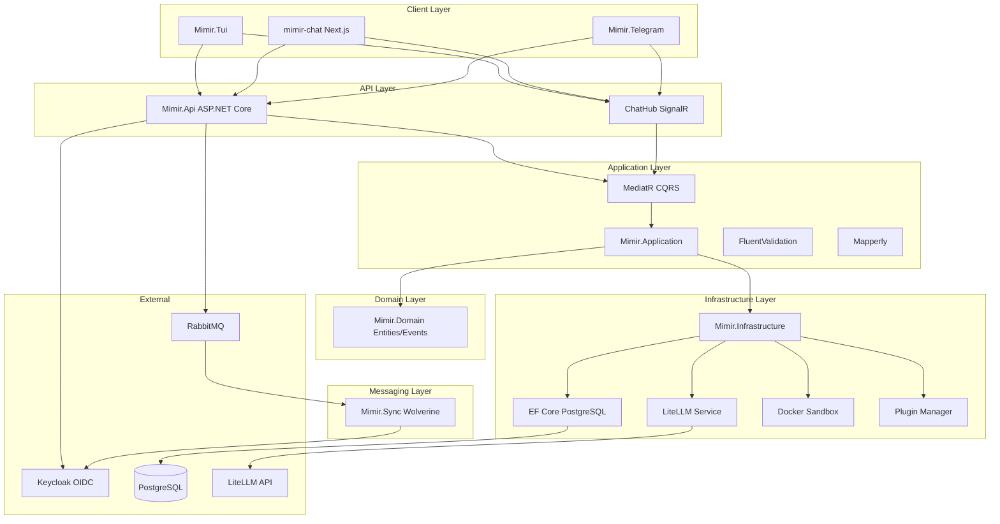
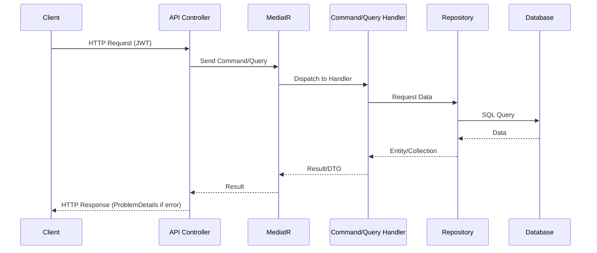
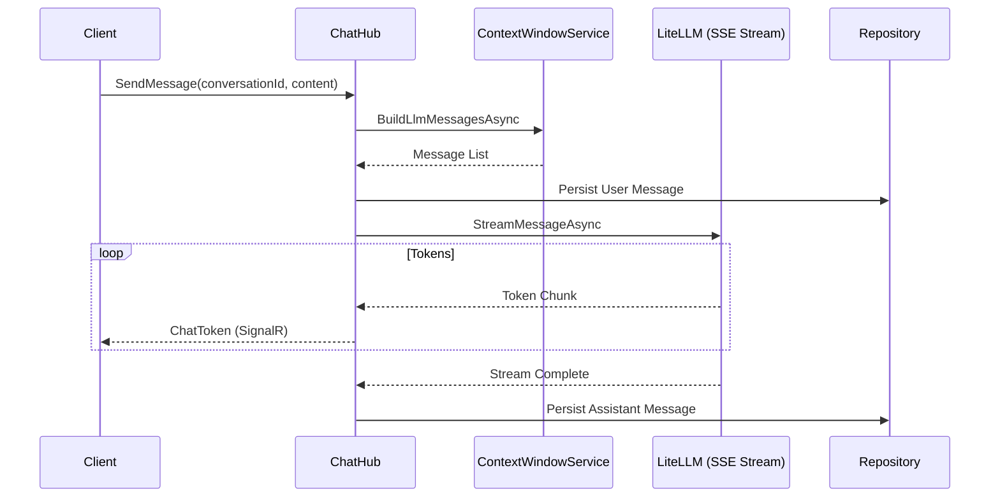
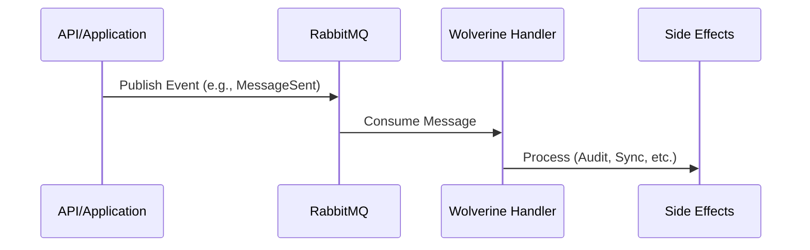

# ADR-004: Architecture Overview

## Status
Accepted

## Date
2026-03-01

## Context
nem.Mimir is an enterprise AI chat platform requiring multi-LLM support, real-time streaming, plugin extensibility, and role-based access control. This ADR documents the architectural decisions that shape the system.

## Decision

### System Architecture

### Request Flows

#### HTTP Request Flow

#### SignalR Streaming Flow

#### Async Messaging Flow (Wolverine)

### Layer Responsibilities
- **Domain**: Pure business logic with no infrastructure dependencies. Contains entities, value objects, enums, and domain events.
- **Application**: MediatR CQRS handlers, DTOs, FluentValidation rules, Mapperly source-generated mappings, and interfaces for infrastructure services.
- **Infrastructure**: Implementation of repositories, EF Core DbContext, external service integrations (LiteLLM, Docker), and persistence interceptors for audit and soft delete.
- **API**: Controllers, SignalR hubs, middleware pipeline (logging, error handling, sanitization), and dependency injection composition root.
- **Sync**: Wolverine message handlers for asynchronous background processing and event-driven side effects.
- **Tui/Telegram**: Standalone client applications that consume the API, each maintaining its own DI and configuration.

### Cross-Cutting Concerns
- **Authentication**: Keycloak OIDC handles identity. API validates JWT Bearer tokens and maps Keycloak roles to standard policy-based authorization.
- **Audit Trail**: EF Core SaveChanges interceptor automatically tracks creation and modification metadata (CreatedAt, CreatedBy, UpdatedAt, UpdatedBy).
- **Soft Delete**: Global query filters combined with an interceptor convert hard deletes into soft deletes by setting IsDeleted=true.
- **Correlation IDs**: Middleware ensures correlation IDs propagate through the entire request pipeline for structured logging.
- **Error Handling**: Global exception handler middleware converts internal errors into standard ProblemDetails responses.
- **Input Validation**: FluentValidation pipeline behaviors validate requests before they reach handlers.
- **Rate Limiting**: Per-user fixed window rate limiting applied to both HTTP controllers and SignalR hubs.

### Federation Independence
Mimir operates independently from the broader nem.* ecosystem. While other nem.* services may share federation patterns, Mimir maintains its own:
- Identity management via private Keycloak instance
- Primary data storage in PostgreSQL
- Messaging backbone via RabbitMQ/Wolverine
- No shared service mesh or API gateway dependencies

## Consequences
- Clean separation enables independent testing of each layer.
- CQRS via MediatR provides clear command/query separation.
- Source-generated mapping (Mapperly) eliminates runtime reflection overhead.
- Wolverine provides reliable async messaging with built-in retry logic.
- Plugin sandbox (Docker) provides security isolation for custom code execution.
