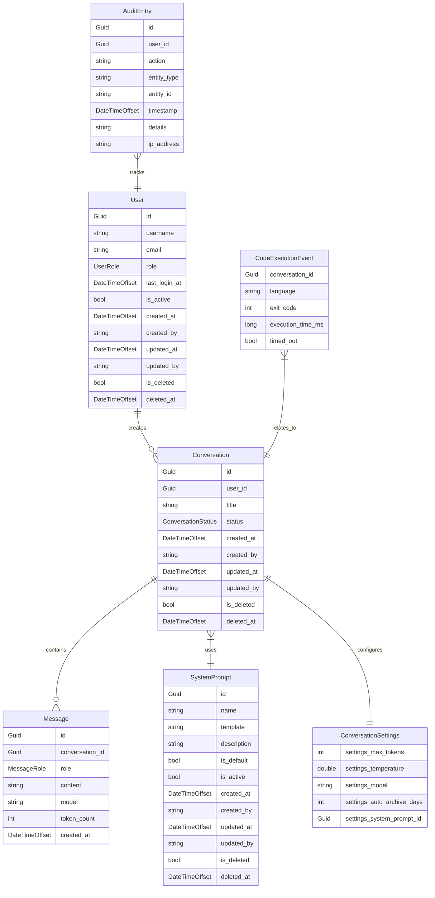

# Data Model — nem.Mimir

## Overview
nem.Mimir's data model is built on an enterprise-ready domain model that prioritizes data integrity, auditability, and clear separation of concerns. The model uses a mix of BaseAuditableEntity for long-lived entities and BaseEntity for transactional records.

## Entity Relationship Diagram

## Entity Catalog

### Base Classes
- **BaseEntity<TId>**: Provides basic identity with a generic Id property and a collection for DomainEvents.
- **BaseAuditableEntity<TId>**: Extends BaseEntity with creation and update metadata (CreatedAt, CreatedBy, UpdatedAt, UpdatedBy) and soft delete support (IsDeleted, DeletedAt).

### User
Table: `users`
| Property | Type | Constraints | Description |
| --- | --- | --- | --- |
| Id | Guid | Primary Key | Unique user identifier |
| Username | string | Required, Max 256 | Keycloak-linked username |
| Email | string | Required, Max 512 | Linked email address |
| Role | UserRole | Enum (string) | System role for authorization |
| LastLoginAt | DateTimeOffset | Optional | Timestamp of the most recent login |
| IsActive | bool | Required, Default: true | Flag to enable/disable user account |

### Conversation
Table: `conversations`
| Property | Type | Constraints | Description |
| --- | --- | --- | --- |
| Id | Guid | Primary Key | Unique conversation identifier |
| UserId | Guid | Foreign Key | Owner of the conversation |
| Title | string | Required, Max 500 | Conversation name or topic |
| Status | ConversationStatus | Enum (string) | Current state (Active, Archived) |
| Settings | ValueObject | Owned | Embedded configuration for this conversation |

### Message
Table: `messages`
*Note: Message extends BaseEntity<Guid>, NOT BaseAuditableEntity.*
| Property | Type | Constraints | Description |
| --- | --- | --- | --- |
| Id | Guid | Primary Key | Unique message identifier |
| ConversationId | Guid | Foreign Key | The conversation this message belongs to |
| Role | MessageRole | Enum (string) | Identity of sender (User, Assistant, System) |
| Content | string | Required | Raw message content |
| Model | string | Optional, Max 100 | The AI model used to generate the message |
| TokenCount | int | Optional | Estimated token count for context tracking |
| CreatedAt | DateTimeOffset | Required | Immutable timestamp of when message was sent |

### SystemPrompt
Table: `system_prompts`
| Property | Type | Constraints | Description |
| --- | --- | --- | --- |
| Id | Guid | Primary Key | Unique template identifier |
| Name | string | Required, Max 200 | Display name of the prompt template |
| Template | string | Required | The actual prompt text containing placeholders |
| Description | string | Optional, Max 1000 | Documentation of the prompt's purpose |
| IsDefault | bool | Required, Default: false | Whether this is the global system default |
| IsActive | bool | Required, Default: true | Flag to enable/disable the template |

### AuditEntry
Table: `audit_entries`
*Note: AuditEntry extends BaseEntity<Guid>, NOT BaseAuditableEntity.*
| Property | Type | Constraints | Description |
| --- | --- | --- | --- |
| Id | Guid | Primary Key | Unique log identifier |
| UserId | Guid | Required | The user who performed the action |
| Action | string | Required, Max 100 | Action description (e.g., Create, Update, Delete) |
| EntityType | string | Required, Max 100 | The name of the affected entity type |
| EntityId | string | Optional | The primary key of the affected entity |
| Timestamp | DateTimeOffset | Required | When the event occurred |
| Details | string | Optional | JSON or text payload with extra details |
| IpAddress | string | Optional, Max 50 | IP address of the requester |

### CodeExecutionEvent
Table: `code_execution_events` (Transactional Event)
| Property | Type | Constraints | Description |
| --- | --- | --- | --- |
| ConversationId | Guid | Required | The conversation triggering the code run |
| Language | string | Required | Runtime environment (python, javascript, etc.) |
| ExitCode | int | Required | Process return code |
| ExecutionTimeMs | long | Required | Duration of the run in milliseconds |
| TimedOut | bool | Required | Whether the process hit the safety limit |

## Value Objects

### ConversationSettings
Embedded configuration for a specific conversation.
- **Model**: Identifier for the LLM model to use.
- **MaxTokens**: Limit on the generated response length. Default: 4096.
- **Temperature**: Controls randomness (0.0 to 2.0). Default: 0.7.
- **AutoArchiveAfterDays**: Days until inactivity triggers archiving. Default: 30.
- **SystemPromptId**: Optional link to a specific SystemPrompt entity.

## Enums

- **UserRole**: `User`, `Admin`
- **MessageRole**: `User`, `Assistant`, `System`
- **ConversationStatus**: `Active`, `Archived`

## Audit Trail Design
Mimir uses an `AuditableEntityInterceptor` within the EF Core `SaveChangesAsync` pipeline. This interceptor serves as the single source of truth for audit fields:
- Automatically populates `CreatedAt` and `CreatedBy` on creation.
- Automatically updates `UpdatedAt` and `UpdatedBy` on any modification.
- Retrieves the current user context via `ICurrentUserService`.
- Audit fields use private setters to prevent manual modification from outside the persistence layer.

## Soft Delete Behavior
All entities inheriting from `BaseAuditableEntity` support soft deletion:
- The interceptor captures `EntityState.Deleted` and converts it to a modified state with `IsDeleted = true`.
- The `DeletedAt` timestamp is recorded during this operation.
- Global query filters are applied to `Conversation`, `User`, and `SystemPrompt` to exclude deleted records from standard queries.
- Administrators can bypass filters using `.IgnoreQueryFilters()` for audit or restoration purposes via the `/api/admin/restore` endpoint.

## Database Configuration
- **Provider**: PostgreSQL 16 via EF Core (Npgsql).
- **Conventions**: Explicit snake_case table and column names are configured in the `Infrastructure/Persistence/Configurations` layer.
- **Concurrency**: Optimistic concurrency is implemented using the PostgreSQL `xmin` hidden column.
- **Indexing**: Database indexes are defined for common lookup fields like `UserId` and `Email`.
