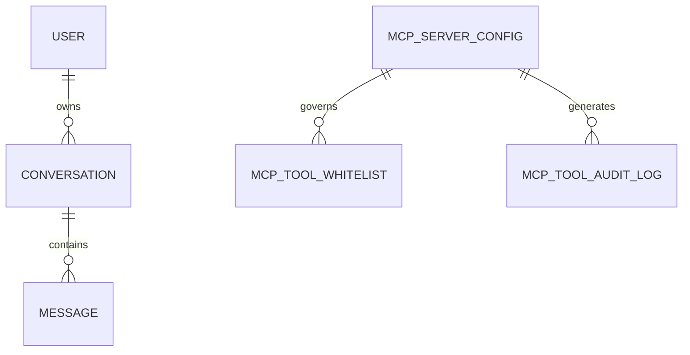

# Data Model Documentation: nem.Mimir

## Overview
Persistence is centered on `MimirDbContext` (PostgreSQL/Npgsql). The model combines conversational entities, identity entities, prompt templates, and MCP operational entities.

## Primary entities
- `User`
- `Conversation`
- `Message`
- `SystemPrompt`
- `AuditEntry`
- `McpServerConfig`
- `McpToolWhitelist`
- `McpToolAuditLog`

## Entity relationship model

## Conversation aggregate
- Table: `conversations`
- Key fields:
  - `id` (Guid, app-generated)
  - `user_id`
  - `title`
  - `status` (enum-as-string)
  - audit fields (`created_at`, `updated_at`, `created_by`, `updated_by`)
  - soft-delete fields (`is_deleted`, `deleted_at`)

Owned value object `ConversationSettings` maps to columns:
- `settings_max_tokens`
- `settings_temperature`
- `settings_model`
- `settings_auto_archive_days`
- `settings_system_prompt_id`

## Message entity
- Table: `messages`
- Key fields:
  - `id`
  - `conversation_id`
  - `role`
  - `content` (`text` column)
  - `model`
  - `token_count`
  - `created_at`

Messages are append-only from business perspective; no soft-delete fields on `Message`.

## User entity
- Table: `users`
- Key fields:
  - `username`, `email`, `role`
  - `is_active`
  - login timestamp
  - auditable + soft-delete columns

Unique index on `email`.

## System prompt entity
- Table: `system_prompts`
- Key fields:
  - `name`, `template`, `description`
  - `is_default`, `is_active`
  - auditable + soft-delete columns

Indexes:
- `ix_system_prompts_is_default`
- `ix_system_prompts_is_active`

## Audit entity
- Table: `audit_entries`
- Captures user action, entity type/id, timestamp, details, and IP.
- Indexed by `(user_id, timestamp)`.

## MCP operational entities
### McpServerConfig
Stores transport mode and connection metadata (`stdio`/`sse`/`streamable-http`) with enabled/disabled state.

### McpToolWhitelist
Per-server allowlist records used by whitelist enforcement before execution.

### McpToolAuditLog
Persists tool execution telemetry: tool name, input/output, latency, success/error.

## Persistence strategy and conventions
- EF Core with explicit table/column names.
- `ValueGeneratedNever()` for application-generated GUID identifiers.
- Optimistic concurrency uses PostgreSQL `xmin` on auditable entities.
- `HasQueryFilter` enforces soft-delete visibility rules on auditable entities.

## Data lifecycle
1. Conversation/message creation from API commands.
2. Update flows (title/settings/prompt metadata).
3. Soft-delete for auditable entities (interceptor and explicit repository logic).
4. Optional admin restore path for supported entity types.

## Query patterns
- User-scoped conversation pagination sorted by `UpdatedAt ?? CreatedAt`.
- Message pagination by `CreatedAt` ascending.
- Prompt pagination and default-prompt lookup.
- MCP server queries include enabled-only views for startup connection.

## Data integrity caveats
- Legacy branch uses primitive IDs throughout most aggregates.
- `Message.content` remains plain text; no persisted structured multimodal payload schema in this branch.

## Cross-references
- [ARCHITECTURE](./ARCHITECTURE.md)
- [BUSINESS-LOGIC](./BUSINESS-LOGIC.md)
- [COMPLIANCE](./COMPLIANCE.md)
- [SECURITY](./SECURITY.md)
