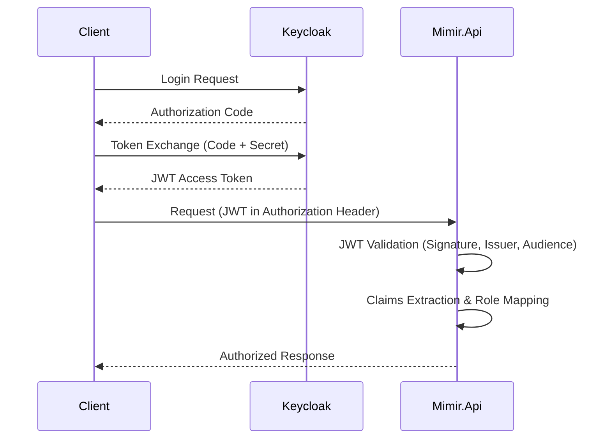
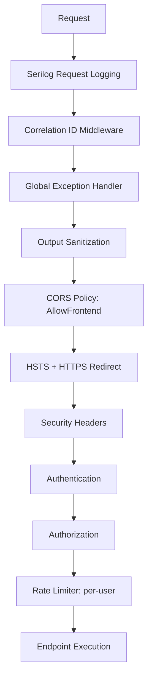

# Security Architecture — nem.Mimir

## Overview
nem.Mimir adopts a defense-in-depth security posture, combining robust identity management, strict input validation, and container-level isolation. The architecture is designed to protect sensitive LLM interactions and user data while maintaining high availability and resilience.

## Authentication Flow
### Keycloak OIDC Integration
Authentication is delegated to Keycloak using the OpenID Connect (OIDC) protocol.

### JWT Configuration
The API validates Bearer tokens using `Microsoft.AspNetCore.Authentication.JwtBearer`.
- **Authority**: Configurable via `JwtSettings:Authority` (Keycloak realm URL).
- **Audience validation**: Required, configured via `JwtSettings:Audience`.
- **RequireHttpsMetadata**: Enforced in production; configurable via `JwtSettings`.
- **MapKeycloakRoleClaims**: A custom event handler maps Keycloak's `realm_access.roles` JSON structure to standard `ClaimTypes.Role` claims during token validation.

### Authorization Policies
Access control is enforced via declarative policies:
- **RequireAdmin**: Requires the "admin" role claim.
- **RequireUser**: Requires either the "user" or "admin" role claim.
- **Application**: Policies are applied using `[Authorize(Policy="RequireAdmin")]` or `[Authorize(Policy="RequireUser")]` attributes on controllers and methods.

## Middleware Pipeline
The ASP.NET Core request pipeline is configured in a specific order to ensure security and observability:

## Input Validation Catalog
### FluentValidation Pipeline
A MediatR validation behavior intercepts all incoming commands and queries, ensuring that business logic only processes valid data.
- **Total Validators**: 21

**Validator List:**
1. ExecuteCodeValidator
2. GetConversationsByUserValidator
3. GetConversationMessagesValidator
4. GetAuditLogValidator
5. GetAllUsersValidator
6. UpdateConversationTitleValidator
7. UpdateUserRoleValidator
8. SendMessageValidator
9. DeactivateUserValidator
10. DeleteConversationValidator
11. CreateUserValidator
12. RestoreEntityValidator
13. CreateConversationValidator
14. ArchiveConversationValidator
15. ListSystemPromptsValidator
16. UpdateSystemPromptValidator
17. DeleteSystemPromptValidator
18. CreateSystemPromptValidator
19. UnloadPluginValidator
20. LoadPluginValidator
21. ExecutePluginValidator

### Input Sanitization
- **ChatHub**: Uses `ISanitizationService` to HTML-encode user messages before processing or persistence.
- **Controllers**: Combines ASP.NET Core model binding with FluentValidation to ensure structural and content integrity.

### Request Size Limits
- **Kestrel**: Global limit of 10MB for request bodies (`MaxRequestBodySize`).
- **SignalR**: Maximum message size capped at 256KB to prevent Denial-of-Service attacks via large payloads.

## Rate Limiting
- **Policy**: Per-user fixed window limiter.
- **Limits**: 100 requests per 60 seconds.
- **Scope**: Applied to all controllers and the SignalR `ChatHub`.
- **Response**: Returns `429 Too Many Requests` when limits are exceeded.

## Output Security
- **OutputSanitizationMiddleware**: Automatically sanitizes response bodies to prevent XSS or data leakage.
- **Log Stripping**: Sensitive data (tokens, credentials) is removed from Serilog output via configuration.
- **Error Handling**: `GlobalExceptionHandlerMiddleware` returns structured `ProblemDetails` responses. Stack traces are suppressed in non-development environments.

## CORS Configuration
- **Allowed Origins**: Configurable via `Cors:AllowedOrigins`.
- **Credentials**: `AllowCredentials` is enabled specifically for SignalR compatibility.
- **Methods**: Restricted to `GET`, `POST`, `PUT`, `DELETE`, `OPTIONS`.
- **Headers**: Explicitly allows `Content-Type`, `Authorization`, and `x-correlation-id`.

## Secrets Management
- **Development**: Managed via `dotnet user-secrets`.
- **Production**: Injected via environment variables. No secrets are stored in configuration files.
- **Template**: `.env.example` provides a template with placeholder values for setup.
- **Externalized**: RabbitMQ, Keycloak, and Telegram credentials are never hardcoded and must be provided by the hosting environment.

## Plugin Sandbox Security
The `CodeRunner` plugin executes user code in highly isolated Docker containers.
- **Isolation**: Each execution uses a fresh, ephemeral container.
- **Network**: `network_mode: none` ensures no external or internal network access.
- **Filesystem**: `read_only: true` with a limited `tmpfs /tmp` (100MB).
- **Resources**: Hard limits on memory (512MB), CPU (1.0), and PIDs (128).
- **Threat Model**: Detailed analysis available in [docs/security-threat-model.md](security-threat-model.md).

## Docker Security
Resource constraints are enforced at the container level:
- **PID Limits**: API container (256), Telegram container (128).
- **Memory Limits**: API (1G), Telegram (256M).
- **CPU Limits**: API (1.0 CPU), Telegram (0.5 CPU).
- **Hardening**: The Telegram container uses a `read_only` filesystem with `tmpfs` for required writable paths.

## Security Headers
The following headers are applied to every response via middleware:

| Header | Value | Purpose |
|--------|-------|---------|
| X-Content-Type-Options | nosniff | Prevents MIME type sniffing. |
| X-Frame-Options | DENY | Prevents Clickjacking by disallowing framing. |
| X-XSS-Protection | 1; mode=block | Enables browser XSS filtering. |
| Referrer-Policy | strict-origin-when-cross-origin | Controls referrer information sent with requests. |
| Content-Security-Policy | default-src 'none'; connect-src 'self' ws: wss:; frame-ancestors 'none'; base-uri 'self'; form-action 'self' | Strict policy for API-only delivery. |

## Audit Trail
- **Mutation Tracking**: `AuditableEntityInterceptor` tracks all entity changes.
- **Audit Metadata**: Records `CreatedBy`, `CreatedAt`, `UpdatedBy`, and `UpdatedAt`.
- **Context Linking**: Correlation IDs link every audit entry to the specific HTTP request that triggered it.
- **Storage**: Detailed logs are stored in the `AuditEntry` entity for compliance and forensics.

## Compliance
- **Status**: See [docs/compliance-audit.md](compliance-audit.md) for full dependency and license audit.
- **OWASP Top 10**: Covered through a combination of OIDC (Broken Access Control), FluentValidation (Injection), Rate Limiting (DoS), and Security Headers (Security Misconfiguration).
